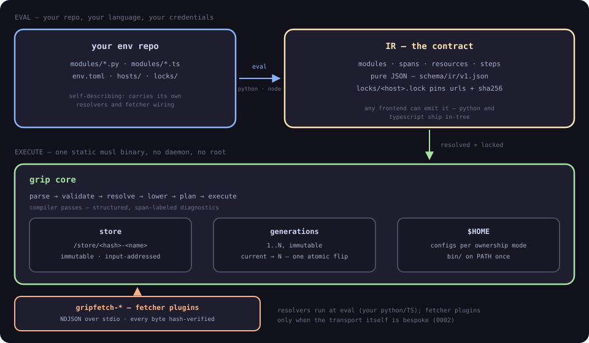

# Architecture

How gripsack turns one git repository into your entire environment —
packages from any source, dotfiles included — on any machine, with
rollback. This page is the friendly tour; the design docs under
[plan/](plan/) have the full details and the reasoning.



## The two halves

gripsack is a compiler, and it keeps its two halves strictly separate:

- **Eval** is sandboxed TypeScript under a pinned, hash-verified Deno:
  no environment variables, no network, no subprocesses, read-only
  within your repo. The machine's facts — os, arch, libc, hostname —
  are detected by the core and injected; host effects are *probes*,
  symbolic requests the core binds. Modules — plain typed code —
  describe what you want: where a tool comes from, how to build it,
  which config files it owns. Evaluation emits **IR**, a JSON graph
  where every node carries a *span* pointing back at the exact line
  of your code that produced it.
- **Execute** is the `grip` binary — one static Rust executable. It
  never evaluates code, never sees your credentials, and only consumes
  IR. It parses, validates, resolves against the lockfile, builds a
  plan, and executes it as a DAG into a hash-addressed **store**.

The payoff of the split: `grip plan` can show you exactly what would
change without changing anything, errors point at your source instead of
at JSON, and the core stays a small, boring, auditable program.

The frontend *source* is embedded in the `grip` binary — the DSL
version always matches the core — so only the runtime provisions: the
first eval downloads the pinned Deno once (per-platform sha256 baked
into grip, ~40MB, cached under `$GRIPSACK_HOME/tools/`;
`GRIPSACK_DENO` overrides). And eval never runs unasked: the first
eval of a repo grip doesn't trust prompts first — naming the path,
the remote, and exactly what the sandbox allows — and `y` records it
(`grip trust list/add/remove`; `GRIPSACK_TRUST_ALL=1` is the CI
bypass). Same repo + same lockfile + same declared host now means the
same graph, because nothing observable is left to the frontend's
environment.

## Modules and sources

Everything is a **module** — a tool, a font, a set of dotfiles. A module
declares typed steps, not scripts: a **source** (GitHub release,
tarball, git, cargo, …), an optional build, where its files go, and
which config files it manages. Modules depend on modules; build-only
dependencies are *ephemeral* — a Rust toolchain used to compile
something doesn't linger in your profile afterward.

When a source is unusual — your company's internal registry — the
sourcing ladder keeps the core small:

1. **built-in fetcher arguments** (`base_url` covers GitHub Enterprise),
2. **fetchers** — `gripfetch-*` plugins for genuinely bespoke
   transports, with the core hash-verifying every byte they return.

Bespoke *resolution* ("latest artifact X" → pinned URL + hash) is
planned as a third plugin kind — `gripresolve-*` executables,
specified in [plan/0013 D8](https://github.com/gripsack-dev/gripsack/blob/main/plan/0013-constrained-evaluation.md)
and built next, not shipped; today the built-ins resolve at
lock/update time.

## Dotfiles, first-class

Config files are deployed per **ownership mode**, chosen per file:

| mode | what it means | use it for |
|---|---|---|
| `owned` | store-owned symlink, read-only | disciplined tools (helix, git) |
| `tracked-copy` | copied out; drift detected next apply | apps that rewrite their own configs |
| `merge` | managed block inside a shared file | `.bashrc`, `.profile` |
| `template` | rendered per machine at activation | hostnames, work vs personal |

You don't have to migrate your packages to use this. A module with no
source at all — just configs — is a first-class setup: brew/apt keep
managing binaries, gripsack manages `~/.config`, and you get versioned
dotfiles with rollback. See
[plan/0006 — gradual migration](plan/0006-gradual-migration.md).

## Generations and rollback

Every apply — one module or the whole graph — builds a complete new
**generation**: an immutable tree of symlinks into the store. Activation
is a single atomic rename (`current → generations/N`), so nothing is
ever half-applied, and rollback is flipping one symlink back. Because
the profile's bin directory is a fixed PATH entry, a flip takes effect
instantly — no shell reload.

**What rollback covers, exactly.** Transactional per generation: store
payloads, symlinks, tracked copies, managed blocks inside foreign
files, and the exported env profile — all restored to the previous
generation's bytes. Not transactional: side effects that already ran
— a service an activation adapter already enabled stays enabled (a
new apply with the adapter removed disables it), and downloads stay
downloaded. The flip is the environment; the world outside it is
yours.

Reproducibility is **pinned inputs and reproducible deployment**, not
hermetic builds: URLs, revisions, and content hashes are locked per
host at resolve time, so machine B deploys what machine A deployed.
gripsack has no sandbox — a shell build step can observe ambient
machine state; hermetic builds are Nix's guarantee, honestly theirs.

## Errors that point at your code

Every IR node carries a span — file, line, column of the module code
that emitted it (the same trick React uses for JSX error stacks). The
core's compiler passes collect structured diagnostics with stable codes:

```diag
error[E101]: module "helix" depends on unknown module "git"
  --> modules/helix.ts:4:1
```

Tomorrow's LSP is a thin shim over these same passes — the analysis is
already done, spans and all. Details:
[plan/0004 — rich IR & passes](plan/0004-rich-ir-and-passes.md).

## Where things live

| path | what |
|---|---|
| `~/.local/share/gripsack/store/` | immutable, hash-addressed payloads |
| `~/.local/share/gripsack/generations/` | one directory per generation |
| `~/.local/share/gripsack/current` | the symlink that IS your profile |
| `~/.config/gripsack/config.toml` | machine-local user config |
| your repo's `env.toml` | the committed, self-describing env config |

`GRIPSACK_HOME` overrides the base directory. Nothing outside your home
is ever touched: no root, no daemon.
