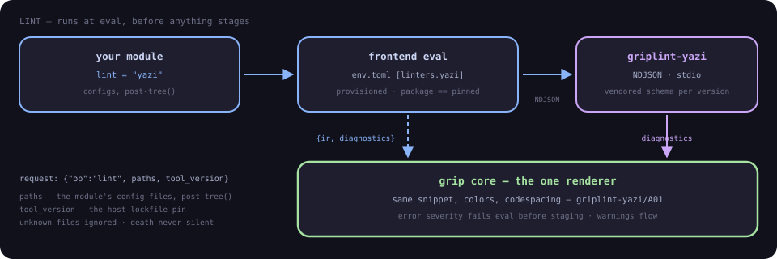

# Linters

Config linters check your config files against the tool's own schema
before anything is staged. A typo'd key in `yazi.toml` deploys cleanly
and fails at tool runtime, in a different terminal, an hour later —
linters close that gap at check time, where the error points at the
offending line.

Since 0.13 the **core** drives linters: `lint = "name"` travels in the
IR, and `grip check`/`apply` run the linter — no Python venv involved,
so linting works under `GRIPSACK_PYTHON` and in CI without a frontend
runtime. Since 0.15 the linters themselves are **data**: every shipped
linter is a versioned data pack embedded in grip
(`crates/griplint/packs`, key tables as TOML) checked by the in-crate
engine **in-process** — no venv, no provisioning, no plugin lifecycle
for first-party linters, and the golden corpus replays byte-exact
against the reference implementation. A new structured-format linter
is a data PR, not a package. External `griplint-*` executables keep
the protocol path for exotic formats.

Status: the engine is shipped and every pack below runs in-process —
the set is what exists today and what's queued, sorted by github stars.

## Coverage

<div class="lint-stats">
  <span><b>22</b> available</span>
  <span><b>29</b> planned</span>
  <span><b>∞</b> the long tail</span>
</div>

<p class="lint-legend"><span class="lg lg-a"></span>available on main<span class="lg lg-p"></span>planned<span class="lg lg-m"></span>help wanted</p>

<div class="lint-grid">
  <a class="lint-tool lt-reference" style="--lt:var(--green)" href="https://github.com/gripsack-dev/gripsack/tree/main/crates/griplint/packs"><span class="lt-name">helix</span><span class="lt-status">reference</span></a>
  <span class="lint-tool lt-available" style="--lt:var(--blue)"><span class="lt-name">alacritty</span></span>
  <span class="lint-tool lt-available" style="--lt:var(--peach)"><span class="lt-name">starship</span></span>
  <span class="lint-tool lt-available" style="--lt:var(--yellow)"><span class="lt-name">yazi</span></span>
  <span class="lint-tool lt-available" style="--lt:var(--mauve)"><span class="lt-name">mise</span></span>
  <span class="lint-tool lt-available" style="--lt:var(--teal)"><span class="lt-name">jj</span></span>
  <span class="lint-tool lt-available" style="--lt:var(--red)"><span class="lt-name">atuin</span></span>
  <span class="lint-tool lt-available" style="--lt:var(--blue)"><span class="lt-name">glow</span></span>
  <span class="lint-tool lt-available" style="--lt:var(--peach)"><span class="lt-name">superfile</span></span>
  <span class="lint-tool lt-available" style="--lt:var(--yellow)"><span class="lt-name">zola</span></span>
  <span class="lint-tool lt-available" style="--lt:var(--mauve)"><span class="lt-name">bottom</span></span>
  <span class="lint-tool lt-available" style="--lt:var(--teal)"><span class="lt-name">git-cliff</span></span>
  <span class="lint-tool lt-available" style="--lt:var(--red)"><span class="lt-name">broot</span></span>
  <span class="lint-tool lt-available" style="--lt:var(--blue)"><span class="lt-name">ruff</span></span>
  <span class="lint-tool lt-available" style="--lt:var(--peach)"><span class="lt-name">rio</span></span>
  <span class="lint-tool lt-available" style="--lt:var(--yellow)"><span class="lt-name">harlequin</span></span>
  <span class="lint-tool lt-available" style="--lt:var(--mauve)"><span class="lt-name">television</span></span>
  <span class="lint-tool lt-available" style="--lt:var(--teal)"><span class="lt-name">procs</span></span>
  <span class="lint-tool lt-available" style="--lt:var(--red)"><span class="lt-name">bacon</span></span>
  <span class="lint-tool lt-available" style="--lt:var(--blue)"><span class="lt-name">claude-code</span></span>
  <span class="lint-tool lt-available" style="--lt:var(--peach)"><span class="lt-name">zed</span></span>
  <span class="lint-tool lt-available" style="--lt:var(--yellow)"><span class="lt-name">gh-dash</span></span>
  <span class="lint-tool lt-available" style="--lt:var(--mauve)"><span class="lt-name">tuicr</span></span>
  <span class="lint-tool"><span class="lt-name">deno</span></span>
  <span class="lint-tool"><span class="lt-name">lazygit</span></span>
  <span class="lint-tool"><span class="lt-name">ghostty</span></span>
  <span class="lint-tool"><span class="lt-name">lazydocker</span></span>
  <span class="lint-tool"><span class="lt-name">Hyprland</span></span>
  <span class="lint-tool"><span class="lt-name">zellij</span></span>
  <span class="lint-tool"><span class="lt-name">kitty</span></span>
  <span class="lint-tool"><span class="lt-name">k9s</span></span>
  <span class="lint-tool"><span class="lt-name">btop</span></span>
  <span class="lint-tool"><span class="lt-name">glances</span></span>
  <span class="lint-tool"><span class="lt-name">delta</span></span>
  <span class="lint-tool"><span class="lt-name">niri</span></span>
  <span class="lint-tool"><span class="lt-name">biome</span></span>
  <span class="lint-tool"><span class="lt-name">fastfetch</span></span>
  <span class="lint-tool"><span class="lt-name">oh-my-posh</span></span>
  <span class="lint-tool"><span class="lt-name">gitui</span></span>
  <span class="lint-tool"><span class="lt-name">rofi</span></span>
  <span class="lint-tool"><span class="lt-name">lsd</span></span>
  <span class="lint-tool"><span class="lt-name">pre-commit</span></span>
  <span class="lint-tool"><span class="lt-name">tmuxinator</span></span>
  <span class="lint-tool"><span class="lt-name">posting</span></span>
  <span class="lint-tool"><span class="lt-name">eza</span></span>
  <span class="lint-tool"><span class="lt-name">waybar</span></span>
  <span class="lint-tool"><span class="lt-name">lf</span></span>
  <span class="lint-tool"><span class="lt-name">taskwarrior</span></span>
  <span class="lint-tool"><span class="lt-name">dunst</span></span>
  <span class="lint-tool"><span class="lt-name">newsboat</span></span>
  <span class="lint-tool"><span class="lt-name">editorconfig</span></span>
  <span class="lint-tool"><span class="lt-name">zathura</span></span>
<a class="lint-tool lt-more" href="https://github.com/gripsack-dev/gripsack/issues?q=label:linter"><span class="lt-name">+ more</span><span class="lt-status">help wanted ↗</span></a>
</div>

Available means a data pack on main in
[crates/griplint/packs](https://github.com/gripsack-dev/gripsack/tree/main/crates/griplint/packs).
Every planned tool has an open tracking issue — a pack is data, so
picking one up is a research-and-tables PR, not a packaging exercise.

## Using a linter

For first-party packs: nothing to register — `lint = "helix"` runs the
embedded pack. External plugins register in `env.toml`; opt in from the
module either way.

```toml
[linters.yazi]
package = "griplint-yazi==1.2.0"      # the published wheel, resolved next to the frontend python

[linters.internal]
path = "/opt/bin/griplint-internal"   # explicit executable — the out-of-tree form
```

```python
module("yazi", ..., lint="yazi")
```

- `package` requires an `==` pin (a wheel, resolved next to the
  frontend python — the frozen 0.10–0.13 path) or names a repo ref
  `"owner/repo@tag"` (a provisioned executable — the lifecycle manager,
  sha256-verified into the plugin store). `path` is the explicit
  executable for development.
- `lint = "<name>"` must resolve against the registry: an
  unregistered name is a hard eval error with the module-line span,
  never a silent skip. There is deliberately no PATH-discovery
  fallback — discovery is how configs end up silently unlinted on one
  machine and linted on another.
- `lint=` is the entire opt-in; there are no per-entry file lists. The
  linter owns the tool's layout knowledge: one `griplint-yazi` covers
  `yazi.toml`, `keymap.toml`, and `theme.toml`, and ignores what it
  doesn't recognize.

## The command surface

The core lints after eval and sema, so every command that evaluates
gets diagnostics for free:

| command | behavior |
|---|---|
| `grip check` | eval + IR sema + linters, then stop: render every diagnostic, exit code = validity, zero side effects — the tight config-editing loop and the CI gate for your dotfiles repo |
| `grip plan` | check + lockfile + diff vs the current generation — "what would change" includes "and by the way, this is broken" |
| `grip apply` | an error-severity lint diagnostic fails eval before anything stages |

Linters are **static shape** (does this key exist in yazi 25.x);
`verify` contracts are **runtime smoke** (does the deployed thing
work). A mode that shells out to the tool itself belongs to the verify
side — the two stay apart.
## The lint flow



a typo'd key fails `grip check` with a span — before anything is
staged, before the tool ever runs:

<div class="window">
  <div class="titlebar"><span class="dot"></span><span class="dot"></span><span class="dot"></span><span class="wtitle">grip check — eval + sema + linters, zero side effects</span></div>
<pre><span class="err">error[griplint-helix/A01]</span>: unknown key [editor] <span class="s">'scrollof'</span>
  <span class="loc">--&gt;</span> <span class="loc">/home/you/env/configs/helix/config.toml:4:1</span>
   <span class="gutter">|</span>
 <span class="loc">4</span> <span class="gutter">|</span> scrollof = 5
   <span class="gutter">|</span> <span class="err">^ not a real key</span>
  <span class="hlp">help</span>: did you mean <span class="s">'scrolloff'</span>?</pre>
</div>

## Writing a linter

A linter is a plain executable speaking NDJSON over stdio — one
request per module–linter pair:

```json
{"op": "lint", "paths": ["configs/yazi/yazi.toml", "configs/yazi/keymap.toml"],
 "tool_version": "25.5.31"}
```

- `paths` is the module's config source set, post-`tree()` expansion;
  repo files are linted in place.
- `tool_version` comes from the host lockfile pin — the lock that pins
  the binary also pins the config schema. Unpinned, the linter uses
  its latest schema and warns.
- Diagnostics come back in the shared shape — same snippet, colors,
  and codespacing as every other gripsack diagnostic. Codes are
  namespaced `griplint-<tool>/<code>` (e.g. `griplint-yazi/A01`); the
  core's `E0xx` range stays reserved. Plugins serialize; only the core
  renders — there is no second renderer.
- Unknown files are ignored, never errors. A linter that chokes on a
  layout it doesn't recognize is a bad linter, not a bad config.
- Death is never silent: a linter that crashes, hangs, or emits
  garbage surfaces as a diagnostic, not a missing check.
The contract made executable:
[griplint-conformance](https://github.com/gripsack-dev/griplint-conformance)
and
[gripfetch-conformance](https://github.com/gripsack-dev/gripfetch-conformance)
— run your plugin against the suite and the envelope stops being
prose.

## Where linters live

In the gripsack repo as data:
[`crates/griplint/packs`](https://github.com/gripsack-dev/gripsack/tree/main/crates/griplint/packs)
— one TOML pack per tool, keyed by tool version, with the golden
fixture corpus beside it. The engine reading them lands in-crate
(plan/0012 move 3); exotic formats (RON, KDL, custom) stay external
`griplint-*` executables over the protocol above, forever. The tables
are community-maintained, and the north star is DefinitelyTyped: the
tool's owners eventually own their linter, and gripsack just provides
the envelope and the renderer.

Full design: [plan/0010](https://github.com/gripsack-dev/gripsack/blob/main/plan/0010-plugin-provisioning.md),
[plan/0011](https://github.com/gripsack-dev/gripsack/blob/main/plan/0011-validation-plugins.md),
and [plan/0012](https://github.com/gripsack-dev/gripsack/blob/main/plan/0012-linters-in-core.md).
